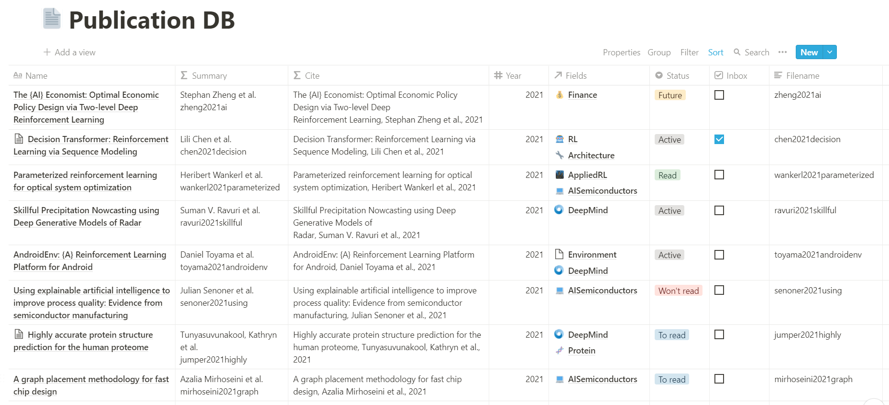
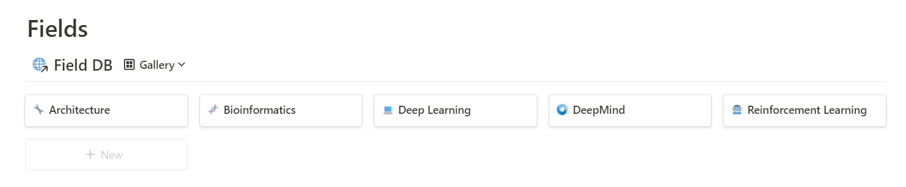
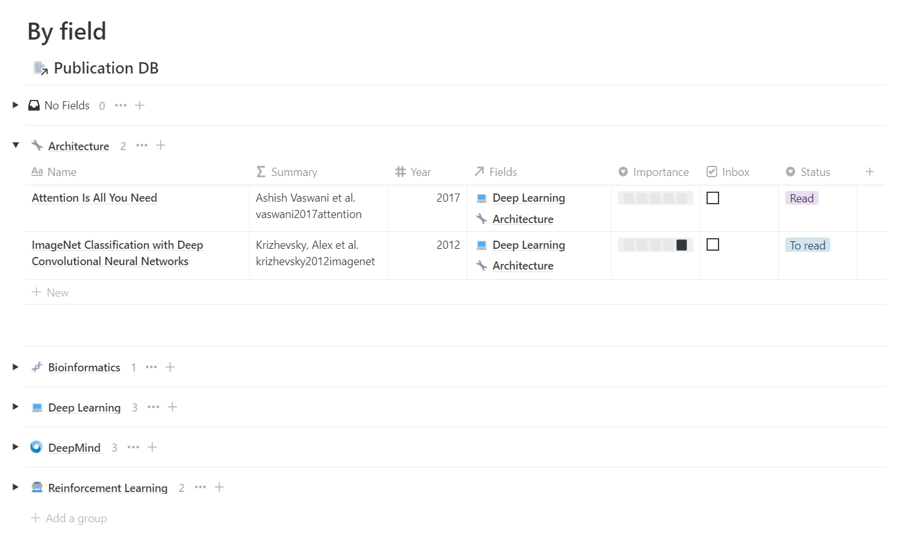

# notion-scholar

Reference management solution using Python and Notion. 

The main idea of this app is to allow to furnish a Notion database using a BibTex formatted string or file. It also helps you to organize papers, create a bibliography and give you the opportunity to annotate the publications directly on their Notion's pages.

## Database 



_Example of a database obtained using notion-scholar._

### Requirements

The properties necessary to import publications in the database are the following:
* title _(Name of the page)_ 
* authors _(Text)_
* year _(Number)_
* journal _(Text)_
* filename _(Text)_
* url _(URL)_
* abstract _(Text)_
* bibtex _(Text)_
* inbox _(Checkbox)_  

The properties can have any capitalization.

## Template 

<details><summary>Dashboard template images</summary>




  

____  


</details>

[Link to the template](https://thomashirtz.notion.site/notion-scholar-a212906553b34a03bcb81c89837cedf6)


## Installation


```
pip install git+https://github.com/thomashirtz/notion-scholar#egg=notion-scholar
```
You can now call the application using `notion-scholar` or `ns`

## Setting up 

### 1. Creation of an integration

Create an [integration](https://www.notion.so/my-integrations) for the notion-scholar database. The integration needs to target the workplace containing the publication database.

Option needed:
- [x] Internal Integration
- [x] Read content
- [x] Update content
- [x] Insert content

Copy the `Internal Integration Token` for the [step 3](#3-set-the-token-and-database_id-in-notion-scholar).

### 2. Share the database with the Integration  

Go to your database in notion => Click on Share => Invite => Select the integration that you just created.

Copy the link of the database (simply the URL on a browser, on the application => Click on `...` => Copy Link) for the [step 3](#3-set-the-token-and-database_id-in-notion-scholar).

### 3. Set the token and database_id in notion-scholar
For the first use, it is recommended to set up the configuration file. The main parameters to save are the token (which will be securely saved using the ["keyring"](https://pypi.org/project/keyring/) library) and the database-url.
```
ns set --token <token> --database-id <database_id>
```
or
```
ns set -t <token> -db <database_id>
```

The database_id is one part of the URL:
`https://www.notion.so/<workspace_name>/<database_id>?v=<view_id>`

### Bib file path
If you want to set the default bib path that will be used when the `ns` run is called, you can set it by typing:
```
ns set --bib-file-path <bib_file_path>
```
or
```
ns set -f <bib_file_path>
```
**The bib file needs to exist and the file path needs to be absolute.**
### Inspecting & clearing the configuration

It is possible to see all the configurations saved by typing:
```
ns inspect-config
```
Moreover, it is possible to erase all the config saved (token, database_url, ...) by running:
```
ns clear-config
```

### How to use ?

There is three main way to use this application:

1. [Setting up](#bib-file-path) the `bib-file-path` and call the `run` mode (It will automatically upload the new publications from the bib file into the database):
```
ns run
```
2. Giving the `bib-file-path` argument: 
```
ns run -f <bib-file-path>
```
3. Giving a `bib-string` argument (/!\ be careful to type three quotes `"""` before pasting the `bib-string`) : 

```
ns run -s """"<bib-string>"""
```
**The `--token` (`-t`) and the `--database_url` (`-db`) are also required, however, if they have been `set`, they don't need to be added again to the argument list.**
  
## Help

For getting help it is possible to call:
```
ns --help
```

<details><summary>Output:</summary>
  
```
usage: Use "notion-scholar --help" or "ns --help" for more information

notion-scholar

positional arguments:
  {run,set,inspect-config,clear-config}
                        Selection of the action
    run                 Run notion-scholar.
    set                 Save the default values of notion-scholar.
    inspect-config      Inspect the notion-scholar config.
    clear-config        Clear the notion-scholar config.

optional arguments:
  -h, --help            show this help message and exit
```

</details>


Four main mode exists: `run`, `set`, ` inspect-config` and `clear-config`. The help can be called this way:
```
ns <mode> --help
```

```
ns run --help
```
<details><summary>Output:</summary>
  
```
usage: Use "notion-scholar --help" or "ns --help" for more information run [-h] [-t] [-db] [-f] [-s]

optional arguments:
  -h, --help            show this help message and exit
  -t , --token          Token used to connect to Notion. (default: None)
  -db , --database-id   Database that will be furnished. The database_id can be found in the url of the database:
                        https://www.notion.so/{workspace_name}/{database_id}?v={view_id} (default: None)
  -f , --bib-file-path
                        Bib file that will be used. This argument is required if the bib file is not saved in the
                        config and no bib-string is passed. (default: None)
  -s , --bib-string     Bibtex entries to add (must be in-between three quotes """<bib-string>"""). By default, the
                        entries will be saved to the bib file from the config. It is possible to disable this behavior
                        by changing the "save" option: "ns setup -save false".
```

</details>


```
ns set --help
```
<details><summary>Output:</summary>
  
```
usage: Use "notion-scholar --help" or "ns --help" for more information set [-h] [-f] [-s] [-t] [-db]

optional arguments:
  -h, --help            show this help message and exit
  -f , --bib-file-path
                        Save the input file path in the user config using "platformdirs". The path must be absolute
                        and the file need to exist. (current: None)
  -s , --save           Set whether the entries from "bib-string" will be saved in the bib file. (current: True)
  -t , --token          Save the Notion token using "keyring". (current: None)
  -db , --database-id   Save the database-id in the user config using the library "platformdirs". The database_id can
                        be found in the url of the database:
                        https://www.notion.so/{workspace_name}/{database_id}?v={view_id} (current: None)```
```
</details>


## Tips
### Bibtex keys

When uploading a BibTex file into the database, the BibTex citekey will be mapped to the property "filename". This is because it seems convenient to have the same name for the key and the filename. It is therefore advised to change the citekey before uploading to Notion.

This is ~ the nomenclature I used for the citekey [(source)](https://academia.stackexchange.com/a/139742). Feel free to take inspiration:

<details><summary>Nomenclature</summary>

**Filename:**  
`aaaayyyyxxxx.pdf`

**Where:**  
- `aaaa`: Name of the first author (variable length)
- `yyyy`: Year of publication (fixed length)
- `xxxx`: First word of title, minus articles and other small words (variable length)

**For example:**  
Attention Is All You Need, Ashish Vaswani et al., 2017

**Would give:**  
`vaswani2017attention.pdf`

If an author publish two papers the same year with the same beginning first word, it is possible to add an `1` and `2` depending on which one was the first released.

For example:  
- Soft Actor-Critic Algorithms and Applications, Tuomas Haarnoja et al., 2018
  `haarnoja2018soft1.pdf`
- Soft Actor-Critic: Off-Policy Maximum Entropy Deep Reinforcement Learning with a Stochastic Actor, Tuomas Haarnoja et al., 2018
  `haarnoja2018soft2.pdf`

</details>
    
### Copy equation properties

It is possible to copy the equation in the table view. [Here](https://www.reddit.com/r/Notion/comments/erdtad/comment/ff4zefs/?utm_source=share&utm_medium=web2x&context=3) is a comment to explain how, it can be very useful.

## To-do
  
- [ ] Add docstrings
- [ ] Add possibility to upload files
- [ ] Improve template
  
  
## Feedbacks

If you want to see a new feature, or you have some feedback to give, feel free to email me at [thomashirtz@pm.me](mailto:thomashirtz@pm.me).

## Buy me a coffee ツ  

If this repository helped you or you if you like this project, feel free to support me!  
<a href="https://www.paypal.com/donate/?hosted_button_id=2KQR9V6PRSBPC">
  
</a>
  
## License

     Copyright 2021 Thomas Hirtz

     Licensed under the Apache License, Version 2.0 (the "License");
     you may not use this file except in compliance with the License.
     You may obtain a copy of the License at

         http://www.apache.org/licenses/LICENSE-2.0

     Unless required by applicable law or agreed to in writing, software
     distributed under the License is distributed on an "AS IS" BASIS,
     WITHOUT WARRANTIES OR CONDITIONS OF ANY KIND, either express or implied.
     See the License for the specific language governing permissions and
     limitations under the License.

