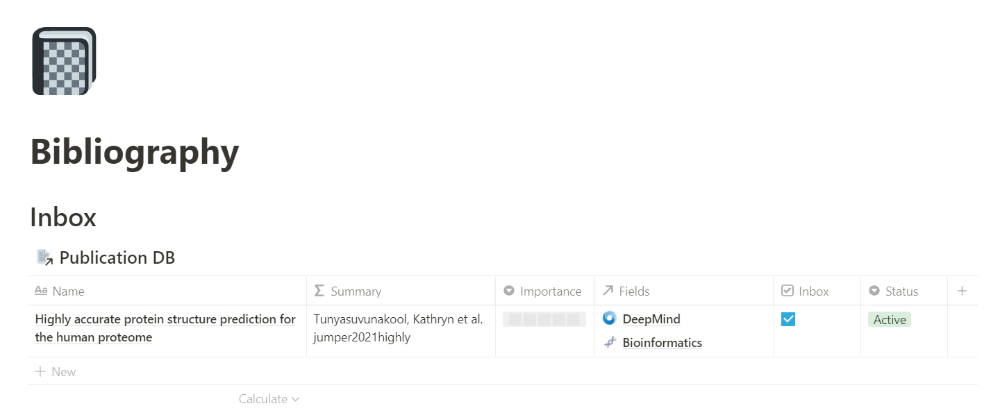
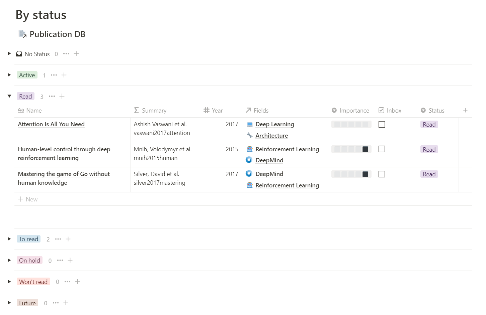
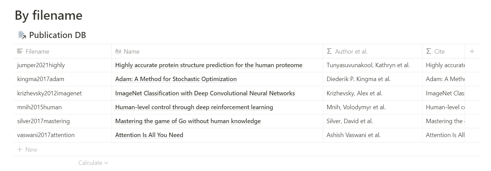
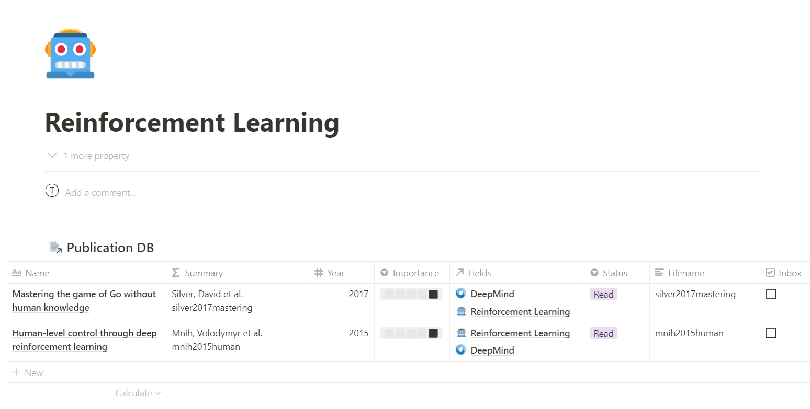

# notion-scholar

Reference management solution using Python and Notion. 

## Database 

### Preview


Each publication possess its own page, it is therefore possible to add some notes links and else to every papers.
### Requirements

The properties necessary to import publications in the database are the following:
* abstract (Text)
* year (Number)
* bibtex (Text)
* filename (Text)
* journal (Text)
* authors (Text)
* url (URL)
* inbox (Checkbox)  

The properties can have any capitalization.

## Template 

<details><summary>Images from the dashboard template</summary>
  
### Preview



  
  
### Field page  


</details>

[Link to the template](https://thomashirtz.notion.site/notion-scholar-a212906553b34a03bcb81c89837cedf6)


## Installation

```
pip install git+https://github.com/thomashirtz/notion-scholar#egg=notion-scholar
```
You can now call the application using `notion-scholar` or `ns`

## Help

For getting help it is possible to call:
```
ns --help
```

Four main command exists: `run`, `set`, ` inspect-config` and `clear-config`. The help can be called this way:
```
ns run --help
```

## Setting up 

### Token and database URL
For the first use it is recommended to set up the configuration file. The main parameters to save is the token (which will be securely saved using the ["keyring"](https://pypi.org/project/keyring/) library) and the database-url.
```
ns setup --token <token> --database-url <database_url>
```
or
```
ns setup -t <token> -db <database_url>
```
Note: The notion token can be found by:   
Launching a browser ⇨ Connect to [notion.so](https://www.notion.so/) ⇨ Inspect (F12) ⇨ Cookies ⇨ token_v2


### Bib file path
If you want to set the default bib path that will be used when the `ns` run is called, you can set it by typing:
```
ns setup --bib-file-path <bib_file_path>
```
or
```
ns setup -f <bib_file_path>
```

### Inspecting & clearing the configuration

It is possible to see all the configuration saved by typing:
```
ns inspect-config
```
Moreover, it is possible to erase all the config saved (token, database_url, ...) by running:
```
ns clear-config
```

## Usage & tips

### How to use ?

There is three main way to use this application:

1. [Setting up](###-Bib-file-path) the `bib-file-path` and calling `ns run` (It will automatically upload the new publications from the bib file into the database)
2. Giving the `bib-file-path` as argument: `ns run -f <bib-file-path>`
3. Giving a bib string as argument: `ns run -s """"<bib-string>"""` !be careful to type three quotes `"""` before pasting the `bib-string`

### Bibtex keys

When uploading a bibtex file into the database, the bibtex citekey will be mapped to the property "filename". This is because it seems convinient to have the same name for the key and for the filename. It is therefore advised to change the citekey before uploading to Notion.

This is ~ the nomenclature I used for the citekey [(source)](https://academia.stackexchange.com/a/139742). Feel free to take inspiration:

<details><summary>Nomenclature</summary>

`aaaayyyyxxxx.pdf`

**Where:**  
- `aaaa`: Name of the first author (variable length)
- `yyyy`: Year of publication (fixed length)
- `xxxx`: First word of title, minus articles and other small words (variable length)

**For example:**  
Attention Is All You Need, Ashish Vaswani et al., 2017

**Would give:**  
`vaswani2017attention.pdf`

If two paper publish the same year, with the same beginning of the word, I add a `1` and `2` depending on which one was first release.

For example:  
- Soft Actor-Critic Algorithms and Applications, Tuomas Haarnoja et al., 2018
  `haarnoja2018soft1.pdf`
- Soft Actor-Critic: Off-Policy Maximum Entropy Deep Reinforcement Learning with a Stochastic Actor, Tuomas Haarnoja et al., 2018
  `haarnoja2018soft2.pdf`

</details>
    
### Copy equation properties

It is possible to copy equation in the table view. [Here](https://www.reddit.com/r/Notion/comments/erdtad/comment/ff4zefs/?utm_source=share&utm_medium=web2x&context=3) is a comment to explain how, it can be very useful.

## Feedbacks

If you want to see a new feature, or you have some feedbacks to give, feel free to email me at [thomashirtz@pm.me](mailto:thomashirtz@pm.me).
